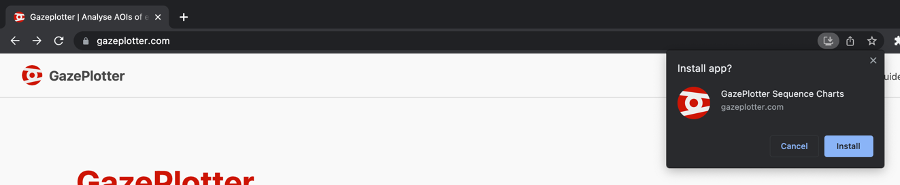
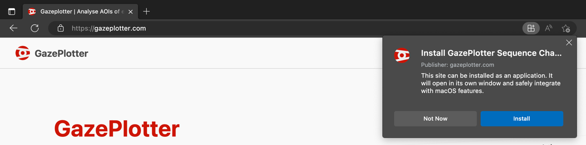
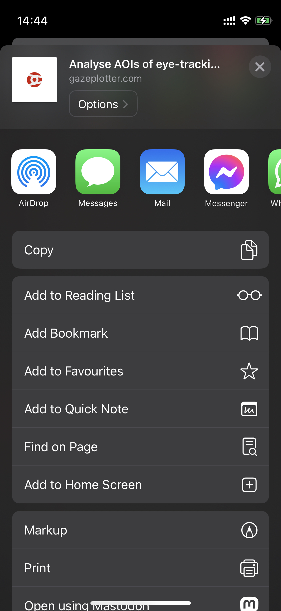

# How to download GazePlotter?
GazePlotter, as a progressive web application (PWA), can be downloaded from the [GazePlotter website](https://gazeplotter.com). The download is available for all the most of major desktop and mobile browsers. 

On MacOS, the download of the PWA is available only in Chrome and Edge.

You can also fork or clone source code of GazePlotter from [GitHub](https://github.com/misavojte/gazeplotter).

## PWA app on Windows, MacOS & Linux
To download GazePlotter on desktop and laptops, click the install button in a search bar of a browser.

Down, you can see examples how the install button looked like in different browsers in April 2023. The button may look different in the future.

### Chrome

### Edge

## PWA app on Android
GazePlotter is available for download on mobile and tablets, too. Usually, the install button is located in the browser's menu. Sometimes, the install button is located in the browser's search bar.

## PWA app on iOS
For iOS iPhones and iPads, the download of the PWA is available only in Safari in April 2023. Press the share button and select `Add to Home Screen`.

## Source code
You can also build and run the GazePlotter site from the source code. More on how to build the site from it is available in the [Dev environment](./app-dev-build.md) section.
