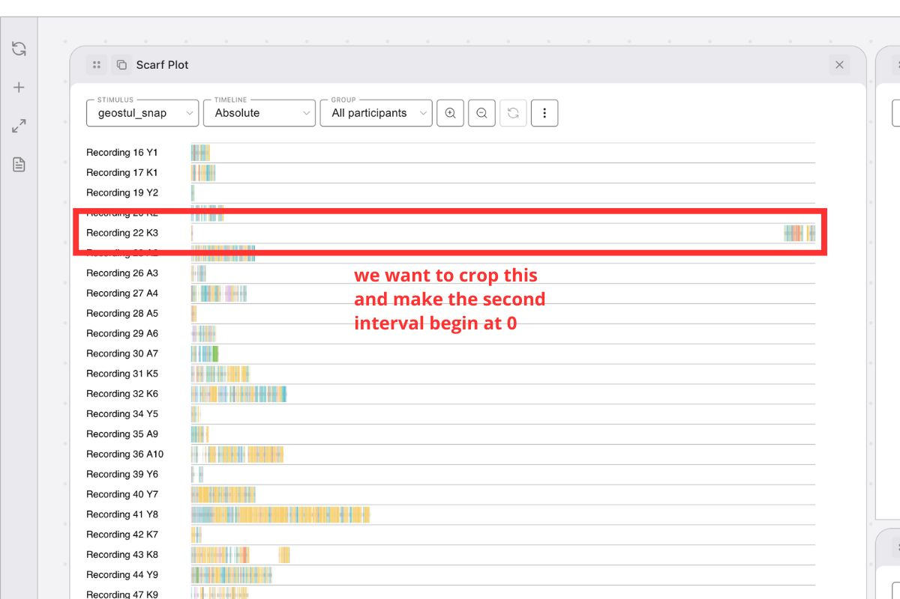
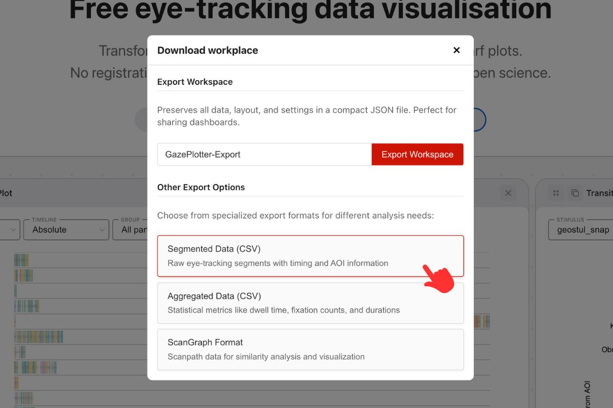
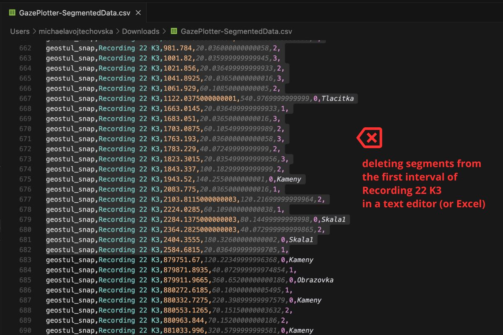
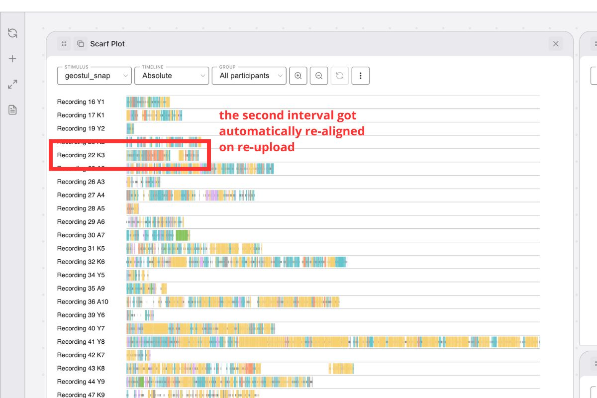

# Segmented Data workflows (export → edit → re‑upload)

Use the Segmented Duration CSV format to round‑trip your data: export segmented data, edit it in a spreadsheet/text editor, and upload it back in the same format. This enables precise operations like cropping early segments or splitting stimuli while keeping correct baselines.

This workflow is particularly useful for **mobile eye-tracking data** where you need to split or merge stimuli based on how image mapping went, or when you need to remove calibration periods and initial setup phases from your analysis.

## Required CSV format

When editing the exported CSV, retain the column structure required by the [Segmented Duration CSV](/upload-data/custom-csv#segmented-duration-csv) format:
- `timestamp` - start time of the segment
- `duration` - duration of the segment  
- `eyemovementtype` - eye movement type (0 = Fixation, 1 = Saccade)
- `participant` - participant name
- `stimulus` - stimulus name
- `AOI` - AOI name (can be empty)

### Important editing guidelines
- **Don't edit timestamps manually**: The system will re-normalize them automatically. Each participant × stimulus combination gets its own baseline
- **Don't leave empty required fields**: Ensure `participant` and `stimulus` are always filled
- **Maintain sequential order**: Ensure that rows remain in sequential order (time) within each participant × stimulus combination

## Typical workflows

### Crop first N segments for a participant in a stimulus
1. Export data as [Segmented Data CSV](/export/segmented-data/).
2. Open the CSV in Excel or a text editor.
3. Filter to the participant and stimulus of interest.
4. Remove the first N rows (segments) you wish to crop.
5. Save the CSV.
6. Re‑upload using [Segmented Duration CSV](/upload-data/custom-csv#segmented-duration-csv).

Result: The upload will re‑normalize timestamps so the first remaining segment of that participant × stimulus starts at 0.

{width="600" height="400"}

{width="600" height="400"}

{width="600" height="400"}

{width="600" height="400"}

### Split one recording into multiple stimuli with correct baselines
1. Export as [Segmented Data CSV](/export/segmented-data/).
2. Duplicate and assign subsets of rows to new stimulus names (e.g., `Stimulus A`, `Stimulus B`).
3. Ensure each subset contains only one stimulus label and consistent participant labels.
4. Save as a single CSV or separate CSV files.
5. Re‑upload via [Segmented Duration CSV](/upload-data/custom-csv#segmented-duration-csv).

Result: Each participant × stimulus subset gets its own baseline (time 0) on upload.

### Break one stimulus into multiple parts based on task phases
1. Export as [Segmented Data CSV](/export/segmented-data/).
2. Identify timestamps where users enter new spaces or process different task parts.
3. Create separate stimulus names for each phase (e.g., `Task_Introduction`, `Task_Main`, `Task_Conclusion`).
4. Rename values in the `stimulus` column to match the new stimulus names based on their timestamps.
5. Save the modified CSV.
6. Re‑upload via [Segmented Duration CSV](/upload-data/custom-csv#segmented-duration-csv).

Result: Each task phase becomes a separate stimulus with its own baseline, enabling analysis of different processing stages.

**Example scenario:**
- Original: One `Shopping_Task` stimulus
- Split into: `Shopping_Product_Selection`, `Shopping_Checkout`, `Shopping_Review`
- Each phase gets its own time baseline for focused analysis

## Related documentation
- [Custom CSV upload](/upload-data/custom-csv)
- [Segmented Data export](/export/segmented-data/)

