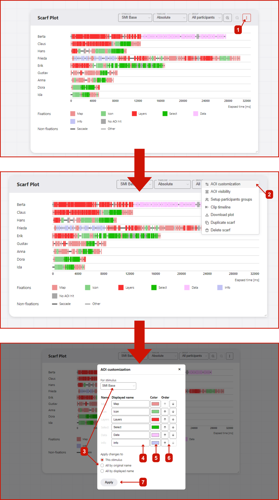

# AOI Customization
GazePlotter allows you to customize the appearance of AOIs in the scarf plot. You can change the color, order, and name of the AOIs. This can help you to better understand the data and to make the visualization more appealing and suitable for your research needs.

## Steps for customizing AOIs
To customize data, follow these steps:
1. Click on the `More options` button in the top right corner of the scarf plot.
2. Select `AOIs customization` from the pop-up menu.
3. In the `AOIs customization` window, you can change whether to apply changes to the current stimulus or to all stimuli in the data. In the case of applying the changes across all stimuli, you can choose whether to apply the changes by the original or displayed name of the AOI. This way, you can rename multiple AOIs in multiple stimuli and then unify their appearance.
4. You can change the displayed name of the AOI.
5. Color of the AOI can be changed by clicking on the color picker button next to the AOI name.
6. You can change the order of the AOI by clicking on the up and down arrows next to the color picker.
7. After you are done with the changes, click on the `Apply changes` button. The scarf plot will be updated with the changes. If you leave the `AOIs customization` window without applying the changes, the changes will be discarded.

::: info
Order of AOIs is changed in the legend and in the scarf plot (on AOIs hit overlap or dynamic AOI visibility lines) as well.
:::