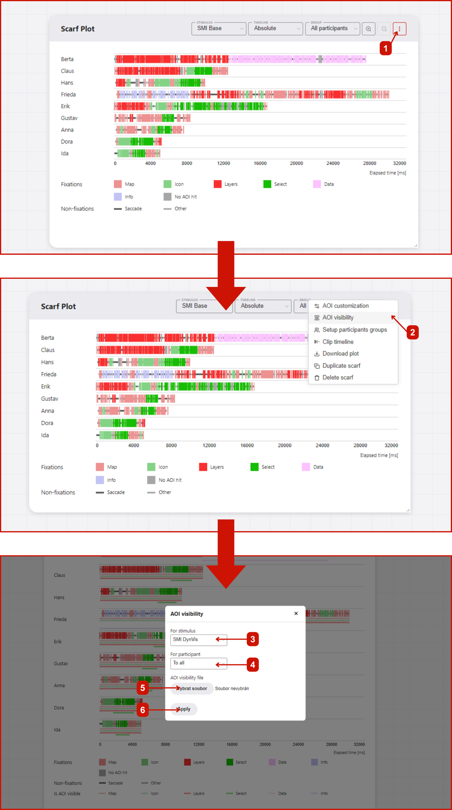
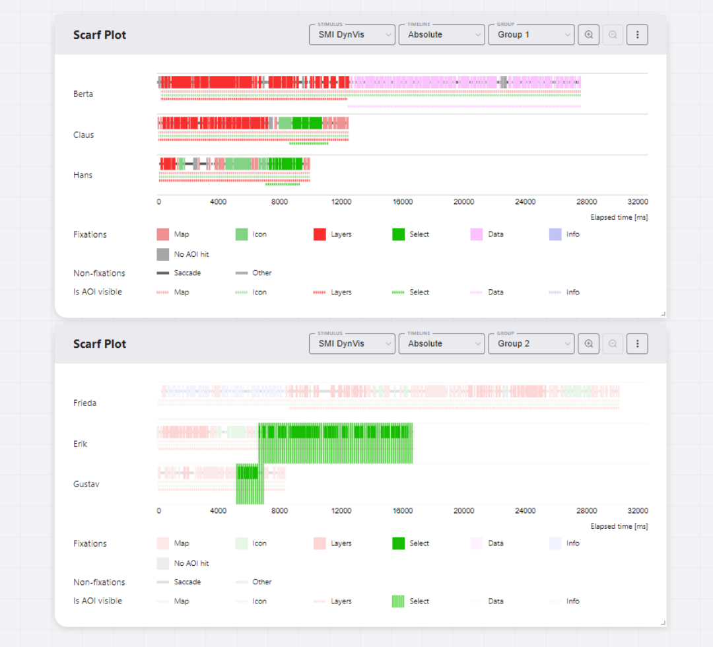

# Adding AOI visibility data

GazePlotter supports the upload of AOI visibility data, allowing for the effective visualization of dynamic AOIs and their visibility in the stimulus. This enhances interpretability of the data and allows for more detailed analysis. 

## Getting AOI visibility data
::: warning
This feature is available only for [SMI BeGaze](/upload-data/smi-begaze.md) and [Tobii Pro Lab](/upload-data/tobii-pro-lab.md) data.
:::
### From SMI BeGaze
In the SMI BeGaze software, open `AOI Editor`. Export the AOI visibility data as `.xml` file by clicking `Save` button. In this file, you can find the information about the visibility of each AOI in a given stimulus.

The exported file can be then simply added to the workplace to already uploaded [SMI BeGaze](/upload-data/smi-begaze.md) data, see below.

### From Tobii Pro Lab
In the Tobii Pro Lab software, open `AOI` tab. Export the AOI visibility data as `.xml` file by clicking `Export` button. In this file, you can find the information about the visibility of each AOI in a given stimulus.

The exported file can be then simply added to the workplace to already uploaded [Tobii Pro Lab](/upload-data/tobii-pro-lab.md) data, see below.

## Adding AOI visibility data to the workplace
As seen on Figure 1, adding AOI visibility data to the workplace have following steps:
1. Click `More options` button in the top right corner of the scarf plot with desired stimulus set.
2. In the pop-up menu, select `Add AOI visibility data`.
3. In new window, select the `.xml` file with AOI visibility data (either from SMI BeGaze or Tobii Pro Lab).
4. Select whether to add the AOI visibility data to all participants or only to the selected one.
5. Click `Apply` button. The AOI visibility data will be added to the workplace.

## Interactivity
Each AOI visibility data is represented by a colored line. This is expanded and thus highlighted when the mouse is moved over the corresponding AOI category in the legend.

