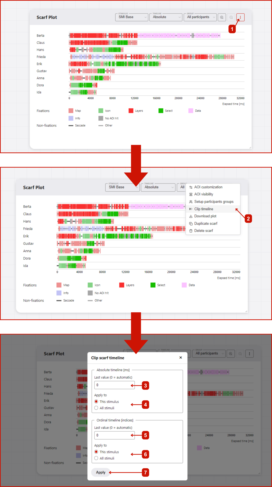

# Clip timeline
Clip timeline is a feature in GazePlotter that allows you to clip the timeline of the scarf plot to a specific time interval. This can be useful for focusing on a specific part of the data, or unifying the timeline across multiple scarf plots for easier comparison.

## Steps for clipping the timeline
Steps and width of the absolute time timeline is by default determined automatically (value = 0). Steps and the highest value are set to display the whole timeline in a 'nice' way. You can modify the highest value of the absolute timeline and ordinal timeline by:
1. Click on the `More options` button in the top right corner of the scarf plot.
2. Select `Clip timeline` from the pop-up menu.
3. In the `Clip timeline` window, you can set the highest value of the absolute timeline in `ms`.
5. Then, you choose whether to apply the changes only to the current stimulus or to all stimuli in the data.
6. Similarly, you can set the highest value of the ordinal timeline in `index` values (e.g., if we want to keep only the first 10 eye movement segments, we set the highest value to 10).
7. After you are done with the changes, click on the `Apply` button. The scarf plot will be updated with the changes. Leaving the `Clip timeline` window without applying the changes will discard the changes.

::: danger
If you change the width of the absolute time timeline to lower value than the width of the longest scanpath, the scanpath will be cut off.
:::
