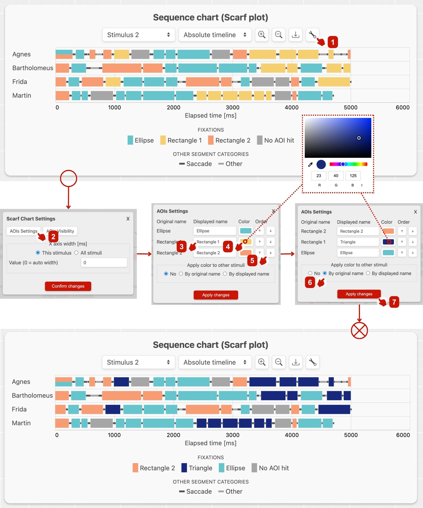
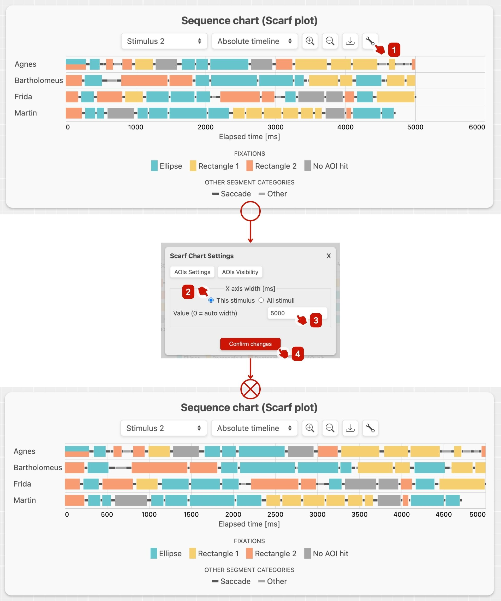

# Customizing scarf plot

GazePlotter's scarf plots can be customized in many ways. Except for changing of [AOI color, order and name](#changing-aoi-color-order-and-name), and width of the [absolute time timeline](#changing-the-width-of-the-absolute-time-timeline), you can also change [timeline representations](/basic/timelines.md) or [add AOI visibility info](/basic/aoi-visibility.md).

## AOI color, order and name

You can change the color, order and name of the AOI:
1. Click on the `Settings` button on the scarf plot.
2. Click on the `AOIs Settings` tab in newly opened settings window.
3. In the `AOIs Settings` tab, you can change the displayed name of AOI.
4. Color of the AOI can be changed by clicking on the color picker button next to the AOI name.
5. You can change the order of the AOI by clicking on the up and down arrows next to the color picker.
6. After you are done with the changes, you can decide whether to apply tha changes in color to only current stimulus or to all stimuli in the data (by its original or displayed name). You can also decide whether to apply the changes in order to only current stimulus or to all stimuli in the data (by its original or displayed name).
7. Click on the `Apply changes` button. The scarf plot will be updated with the changes.

::: info
Order of AOIs is changed in the legend and in the sequence chart (on AOIs hit overlap) as well.
:::

## Width of the absolute time timeline

Steps and width of the absolute time timeline is by default determined automatically. You can change the width of the absolute time timeline by clicking on the `Settings` button in the main workplace and then clicking on the `Timeline Settings` tab in newly opened settings window. In the `Timeline Settings` tab, you can change the width of the absolute time timeline by clicking on the `Change width` button. You can also change the steps of the absolute time timeline:
1. Click on the `Settings` button on the scarf plot.
2. Decide whether you want to change the width only for current stimulus or for all stimuli in the data.
3. Write the new width of the absolute time timeline in `ms` (0 for auto width).
4. Click on the `Confirm changes` button. The scarf plot will be updated with the changes.

::: danger
If you change the width of the absolute time timeline to lower value than the width of the longest scanpath, the scanpath will be cut off.
:::
