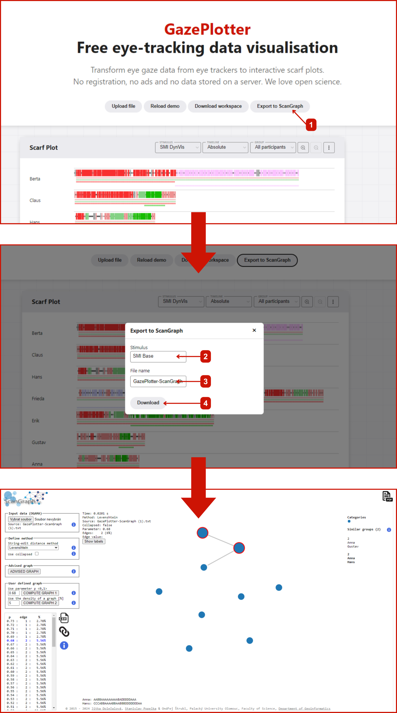

# Export workspace or data

GazePlotter provides several ways to export your workspace or data for further analysis or sharing. To export, click the **Export workspace or data** button (usually found at the top of the workspace), then select the desired export type from the select box in the dialog that appears. See below for details on each export option:

- [GazePlotter Format (recommended)](#exporting-in-gazeplotter-format-recommended)
- [CSV (single file)](#exporting-the-workspace-as-csv)
- [CSV (individual files)](#exporting-as-individual-csv-files)
- [ScanGraph](#exporting-data-for-scangraph)

::: tip
**GazePlotter Format** is the preferred way to export your workspace if you want to import the data back into GazePlotter.  
This keeps the layout and the settings of each visualisation, allowing simple dashboard sharing using a relatively small JSON file.
:::

::: tip
You can export individual visualisations as an image using their options menu.
:::

## Exporting in GazePlotter Format (recommended)

**GazePlotter Format** is the preferred way to export your workspace if you want to import the data back into GazePlotter.  
This keeps the layout and the settings of each visualisation, allowing simple dashboard sharing using a relatively small JSON file.

- Use this format for backup, sharing, or transferring workspaces between users.
- TIP: You can export individual visualisations using their options menu.

To export in GazePlotter Format:
1. In the **Export Format** section, select **GazePlotter** as the type.
2. In the **Export Options** section, set the desired file name.
3. Click **Download** to save the file.

---

## Exporting the workspace as CSV

You can export all data from your workspace into a single CSV file, which is compatible with most spreadsheet applications and data analysis tools.

To export as CSV:
1. In the **Export Format** section, select **CSV** as the type.
2. In the **Export Options** section, set the desired file name.
3. Click **Download** to save the file.

---

## Exporting as Individual CSV files

You can export your workspace as separate CSV files for each recording, which are then zipped together. This is useful when you need to analyze recordings separately or share individual files.

To export as Individual CSV:
1. In the **Export Format** section, select **Individual CSV** as the type.
2. In the **Export Options** section, set the desired file name.
3. Click **Download** to save the zip file.

---

## Exporting data for ScanGraph

GazePlotter supports the export of data to the [ScanGraph](http://eyetracking.upol.cz/scangraph) analysis tool for comparing scan paths similarity. This allows for further analysis of the data and comparison of scan paths between participants.

To export data for ScanGraph:
1. In the **Export Format** section, select **ScanGraph** as the type.
2. In the `ScanGraph Download` window, select the desired stimulus to export.
3. Type in the name of the exported file.
4. Click **Download**.

The exported `.txt` file can then be uploaded to the ScanGraph software. In this file, fixations are saved as a string of letters, where each letter represents a fixation on a given AOI. The key to the letters is saved in the fourth and fifth line of the file.

### Future plans
In the future, we aim to integrate the ScanGraph tool directly into the GazePlotter tool, allowing for a more seamless transition between the two tools and easier data analysis. We are looking for possible contributors to help us with this task. If you are interested, please contact us at [mail@vojtechovska.com](mailto:mail@vojtechovska.com). 