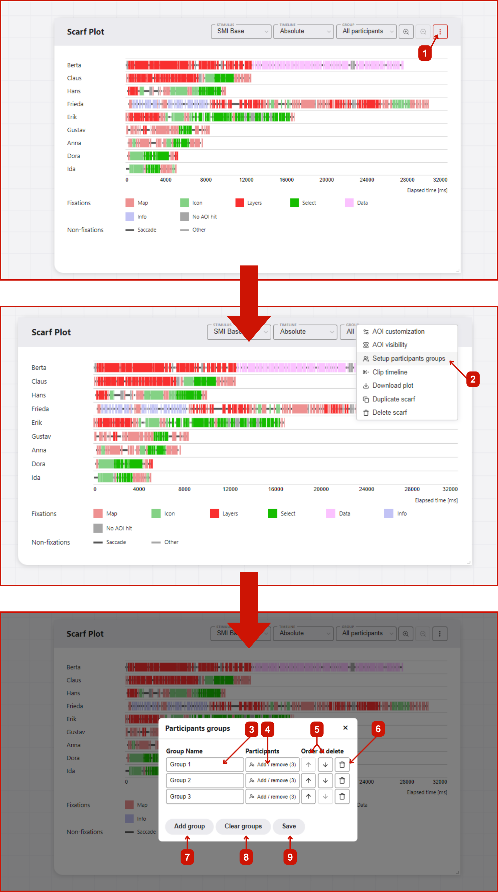

# Participant grouping
Participant grouping is a feature in GazePlotter that allows you to group participants into custom groups for easier comparison and analysis. Groups are created based on the user input, and participants can be assigned to multiple groups. This feature is useful for comparing eye-tracking data between different groups of participants, such as age groups or novice/expert groups.

## Groups editing
Groups can be either created, modified or deleted by:
1. Clicking on the `More options` button in the top right corner of the scarf plot.
2. Selecting `Setup participant grouping` from the pop-up menu.
3. In the `Participant grouping` window, you can rename current groups,
4. add or remove participants from groups,
5. change the order of groups,
6. and delete groups.
7. You can also create a new group by clicking on the `Add group` button.
8. `Clear groups` button clears all groups and participants from groups.
9. After you are done with the changes, click on the `Apply` button. The scarf plot will be updated with the changes. Leaving the `Participant grouping` window without applying the changes will discard the changes.

