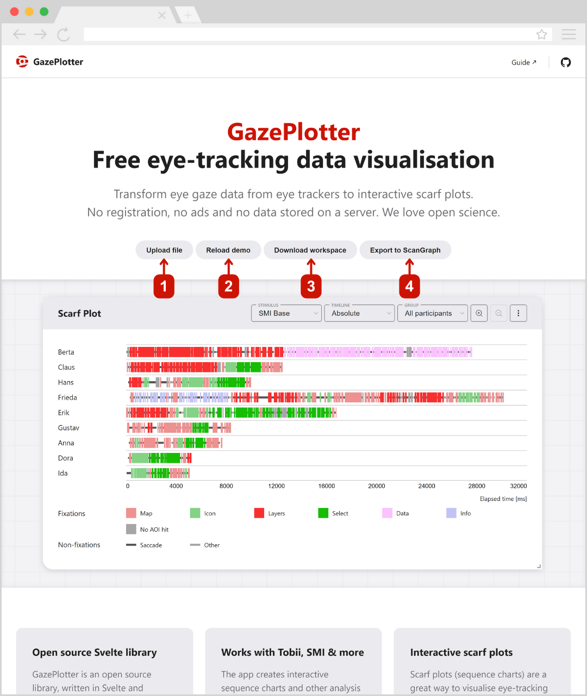

# GazePlotter basic overview
GazePlotter, available at [gazeplotter.com](https://gazeplotter.com), is designed in order to be as easy and intuitive as possible and to provide a quick overview of the data via interactive scarf plots (or sequence charts).

## Starting the app
On visiting the website, you will see a demo data visualization. At the top of the GazePlotter workspace, you can hit the following controls:

1. Upload your own data files to the GazePlotter workplace. The workplace will automatically detect the file type and start a visualization of the data. See [Uploading data](/upload-data/) for more information.
2. Reload the demo data. This will remove all the data from the workplace and load the demo data again.
3. Download the workspace as a `.json` file. This file can be later uploaded to the GazePlotter to restore the data with the modifications you made to it.
4. Export to the ScanGraph format for further AOI analysis. See [Exporting data for ScanGraph](/basic/export/) for more information.

Below, you can see the main workplace overview with the visualization of the data. Upon start, the GazePlotter will show a scarf plot of a demo data set. This demo data includes two stimuli with 6 areas of interest (AOIs) and 9 participants. Participants are grouped into three groups. Second stimulus includes dynamic AOI visibility data.

## Available visualisations

GazePlotter offers multiple visualization types to analyze your eye-tracking data:

- [Scarf plot](/basic/scarf-plot/) - Interactive sequence charts showing gaze patterns over time
- [Transition Matrix](/basic/transition-matrix/) - Matrix visualization of gaze transitions between AOIs
- [Bar Plot](/basic/bar-plot/) - Statistical bar charts for basic quantitative analysis

GazePlotter is designed with a modular architecture, making it easily expandable to accommodate additional visualization types in the future.

## Available data manipulations

GazePlotter provides several tools to customize and manipulate your data for better analysis:

- [AOI customization](/basic/aoi-customization/) - Customize appearance, colors, names, and order of Areas of Interest
- [Stimuli customization](/basic/stimuli-customization/) - Customize and manage stimulus properties and settings
- [Participant grouping](/basic/groups/) - Organize participants into custom groups for comparative analysis
- [Participants customization](/basic/participants-customization/) - Customize participant properties and metadata
- [Export workspace or data](/basic/export/) - Export data in various formats including CSV, JSON, and ScanGraph