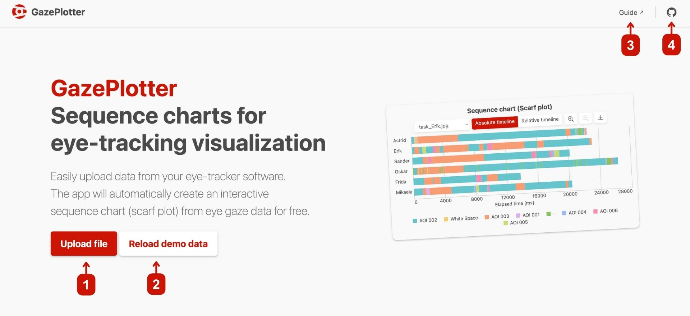
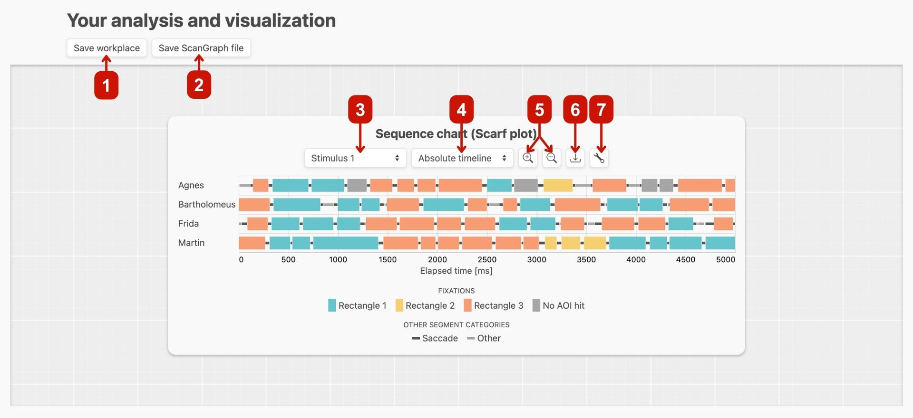
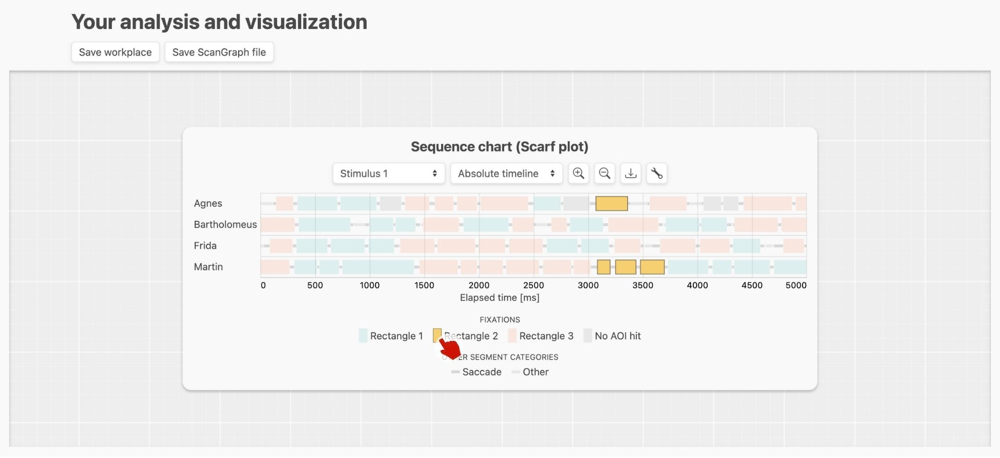
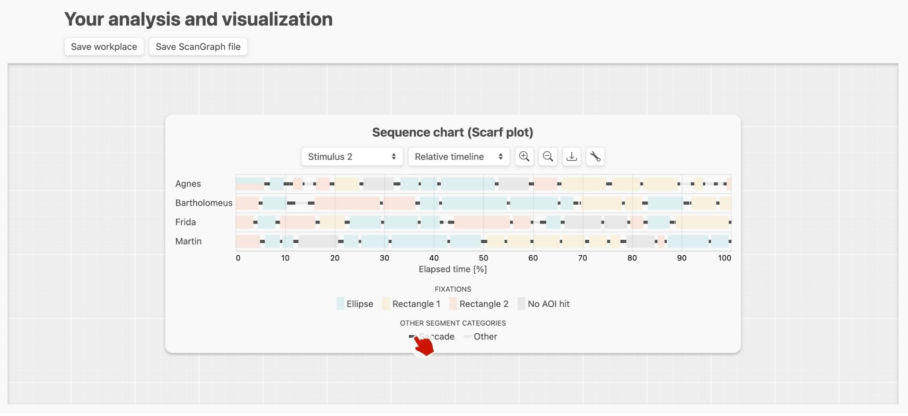
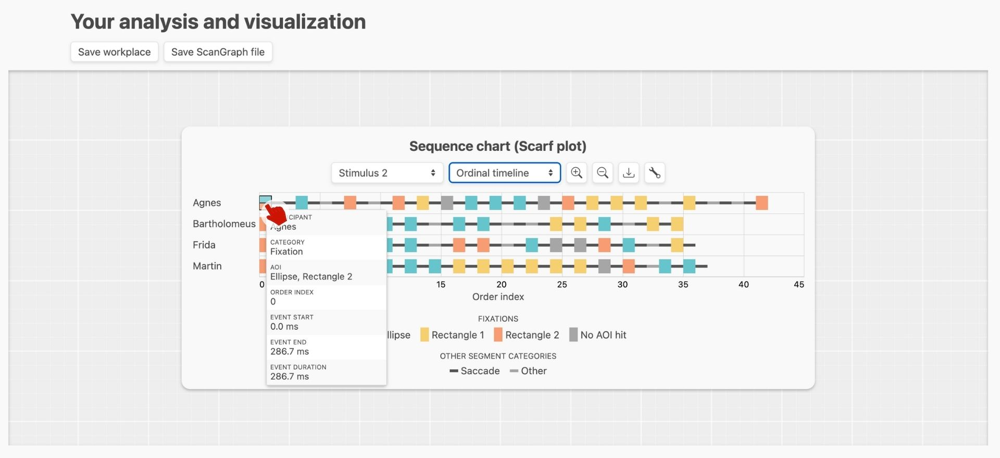

# GazePlotter basic overview
GazePlotter, available at [gazeplotter.com](https://gazeplotter.com), is designed in order to be as easy and intuitive as possible and to provide a quick overview of the data via interactive scarf plots (or sequence charts).

## Starting the app
On visiting the website, you will see a demo data visualization. At the top of the page, you can hit the following controls:

1. Upload your own data files to the GazePlotter workplace. The workplace will automatically detect the file type and start a visualization of the data. See [Uploading data](/upload-data/) for more information.
2. Reload the demo data. This will remove all the data from the workplace and load the demo data again.
3. See the documentation of the app.
4. See the GitHub repository of the app.

## Main workplace overview
When scrolling down, you will see the main workplace with visualization of the data. You can click following controls:

1. Save the data to a `.json` file. This is useful if you want to share your data with someone else.
2. Save the data to a `.txt` file compatible with [ScanGraph](http://eyetracking.upol.cz/scangraph/). See [ScanGraph integration](./scangraph-integration.md) for more information.
3. Switch between stimuli in data (if you have more than one stimulus in your data).
4. Switch between timeline representations. See [Timelines](./timelines.md) for more information.
5. Zoom in and out the timeline.
6. Download the current visualization as a `.png`, `.jpg`, `.webp` or `.svg` image.
7. Open more settings for customizing the scarf plot, e.g., adding [AOI visibility info](./aoi-visibility.md) changing AOI color, name etc. See [Customizing the scarf plot](./customizing-scarf-plot.md) for more information.

## Interactivity overview
The scarf plot is interactive. You can hover over the AOI category to highlight fixations in that category in the sequence chart.

This is valid for non-fixation categories as well, you can highlight saccades and others in the sequence chart.

You can also click on a segment in the sequence chart to show more detailed corresponding information about it.

