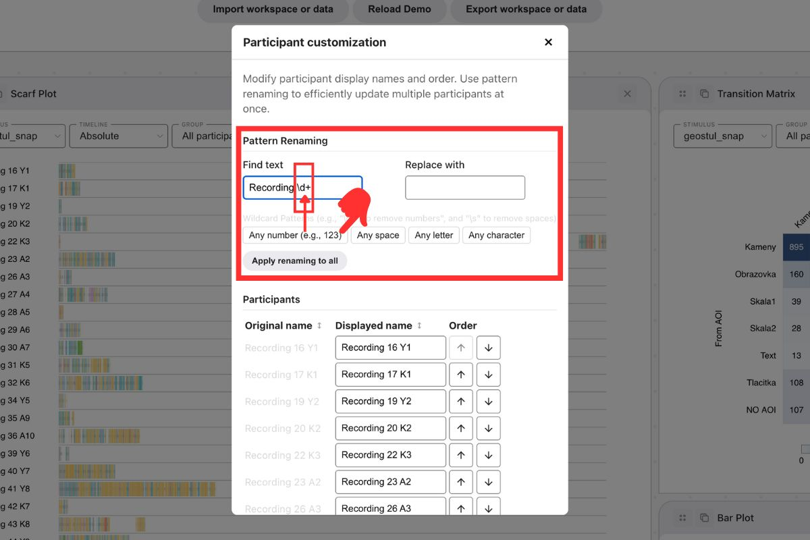
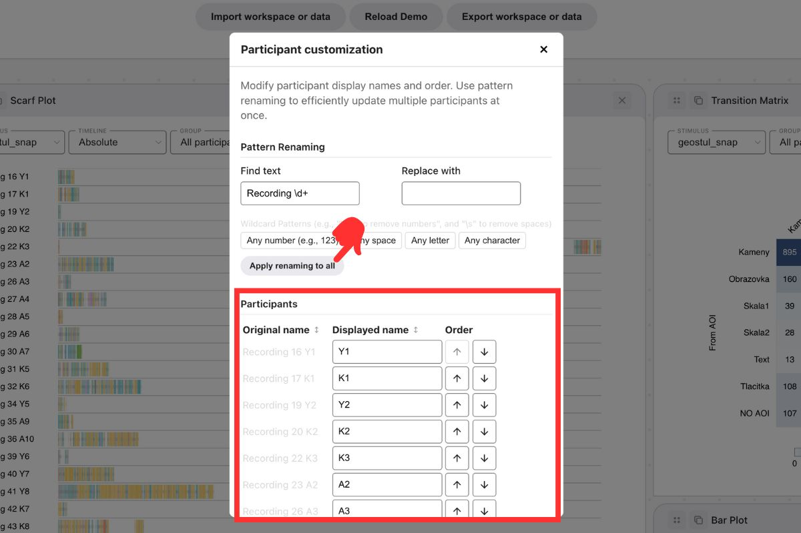

# Participants customization

Participant customization in GazePlotter allows you to rename participants and change their display order in eye-tracking plots that display participant names (legends, axes, grouping). You can use pattern-based renaming for batch operations or edit individual participant names.

{width="600" height="400"}

{width="600" height="400"}

## Accessing participant customization
To customize participants:
1. Click on the `More options` button in the top right corner of any plot.
2. Select `Participant customization` from the pop-up menu.

## Pattern Renaming
Pattern renaming allows bulk renaming operations using regular expressions for find-and-replace across all participants.

### Find and Replace
1. Enter text or pattern to find in the `Find text` field
2. Enter replacement text in the `Replace with` field
3. Click `Apply renaming to all` to execute the replacement

### Wildcard Patterns
Wildcard buttons insert regex patterns into the Find text field:
- **Any number (e.g., 123)** → `\d+` - matches one or more digits
- **Any space** → `\s` - matches any whitespace character
- **Any letter** → `[A-Za-z]` - matches any single letter
- **Any character** → `.` - matches any single character

### Common Use Cases
Simple examples:
- Remove numbers: Find `\d+`, Replace with empty
- Remove spaces: Find `\s`, Replace with empty  
- Replace prefixes: Find `Participant`, Replace with `P`
- Standardize naming: Find `_`, Replace with `-`

### Complex Example
Transform `Recording34 P20` to `P20`:
- **Find text**: `Recording\d+\s` 
- **Replace with**: `` (empty)
- **Result**: `Recording34 P20` → `P20`

This pattern breaks down as:
- `Recording` - matches the literal text "Recording"
- `\d+` - matches one or more digits (34)
- `\s` - matches the space after the number

### Advanced Regex Usage
You can input any valid regular expression in the Find text field. For complex patterns, consider using AI tools like ChatGPT to generate regex patterns by describing your transformation needs.

## Individual Participant Editing
For each participant you can:
- Edit the `Displayed name` while keeping the original name unchanged
- Change participant order using the up/down arrows in the `Order` column

### Bulk Participant Sorting
Click on column headers to sort participants:
- **Original name** - sorts by the original participant names
- **Displayed name** - sorts by the current displayed names
- Click again to reverse sort direction (ascending/descending)

The sorting uses natural ordering, so `Participant10` correctly comes after `Participant2` (not alphabetically before it).

## Applying Changes
Click `Apply` to save all modifications. Changes are discarded if you close the window without applying. 