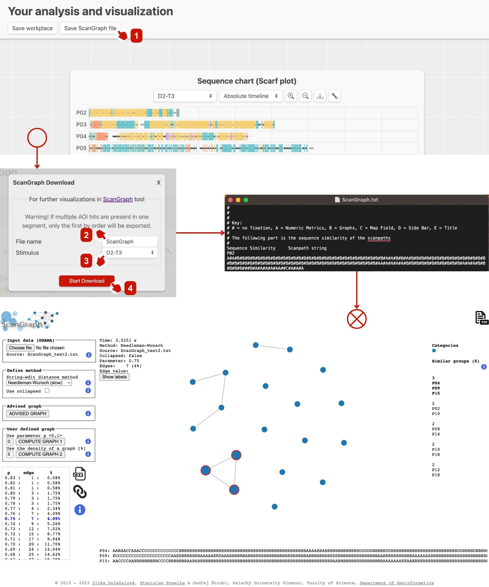

# Exporting data for ScanGraph

GazePlotter supports the export of data to the [ScanGraph](http://eyetracking.upol.cz/scangraph) analysis tool for comparing scan paths similarity.

To export data to ScanGraph:
1. Click `Save ScanGraph file` button in the top left corner of the workplace.
2. In the `ScanGraph Download` window, type the name of the file.
3. Select the desired stimulus set.
4. Hit `Start download` button.

The exported `.txt` file can be then simply uploaded to the ScanGraph software. In this file, fixations are saved as a string of letters, where each letter represents a fixation on a given AOI. The key to the letters is saved in the fourth and fifth line of the file.

