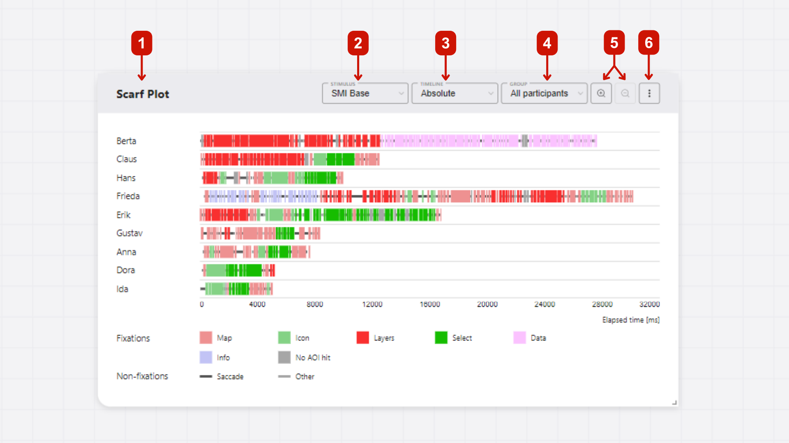
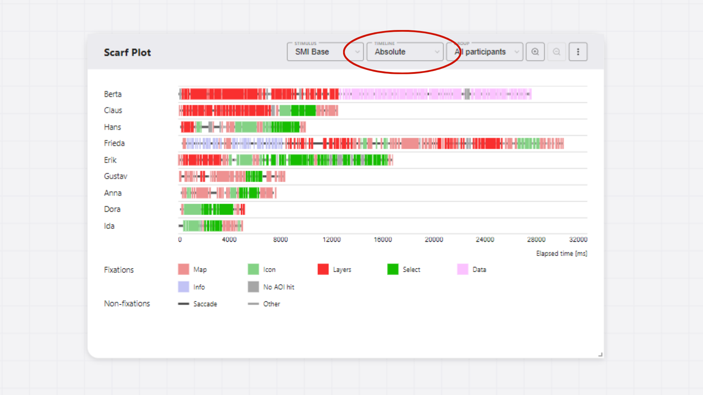
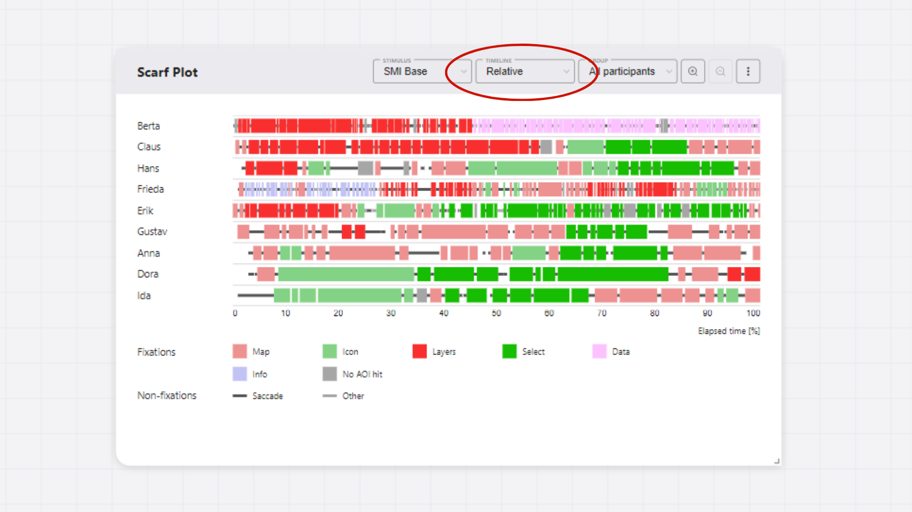
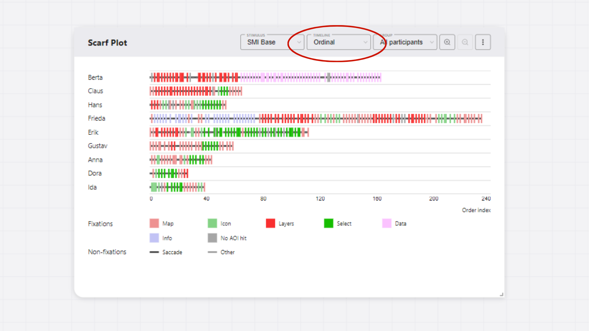
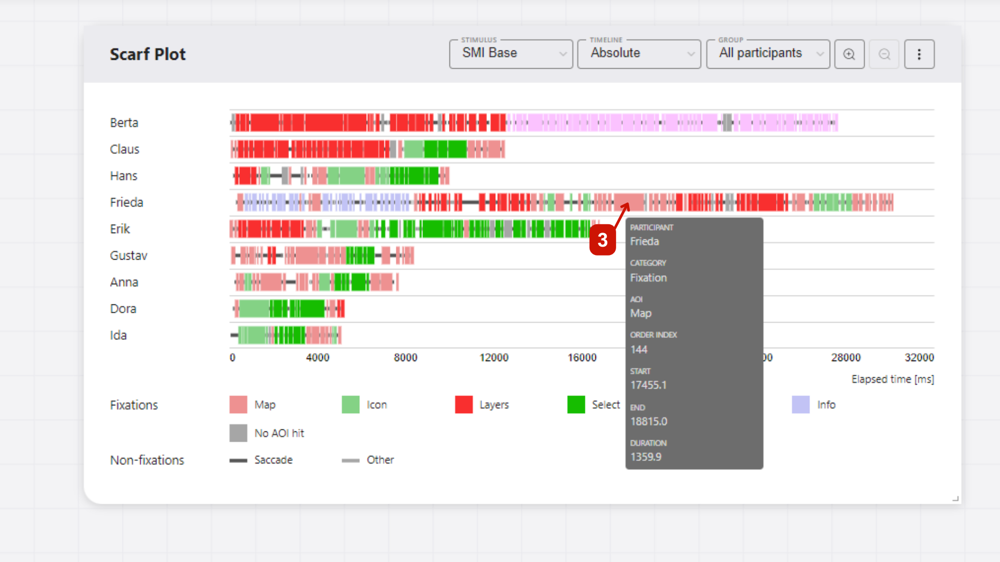
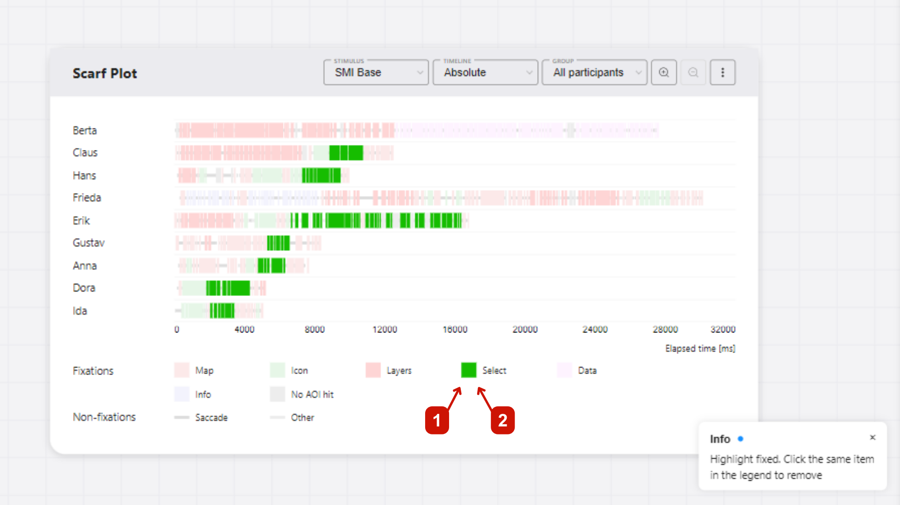
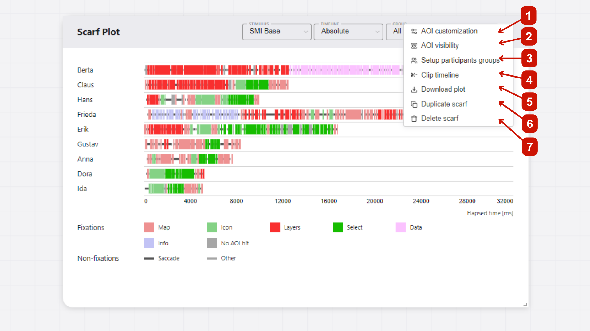
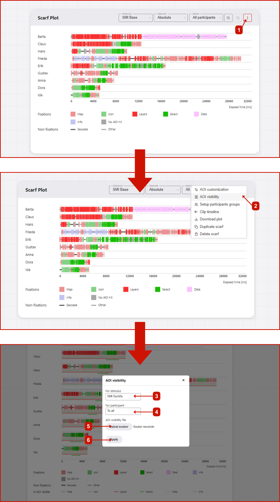
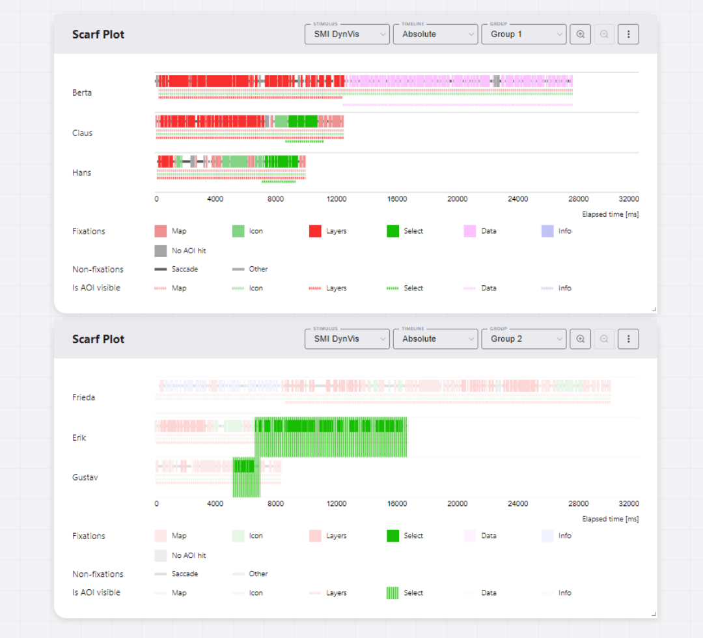
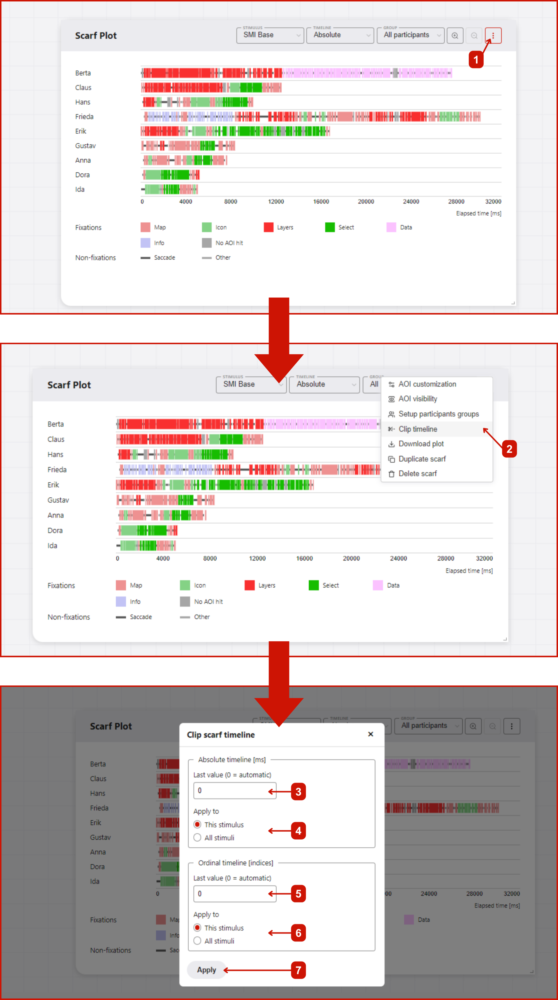

# Scarf plot
Scarf plot (or sequential graph) is a visualization of eye movement data that shows the sequence of fixations and saccades in time. It is a useful tool for analyzing the order of fixations and saccades, and for comparing the scanpaths of different participants or stimuli. Specific areas of interest (AOIs) in the given stimuli are color-coded and displayed in the scarf plot. The scarf plot is the main visualization tool in GazePlotter, and it is used to visualize eye-tracking data from various eye-tracking software.

## Basic controls
In GazePlotter, scarf plots have following main controls:
1. **Title** - the title of the scarf plot, which can be changed by clicking on it.
2. **Stimulus selector** - a drop-down menu for selecting the stimulus to be displayed in the scarf plot.
3. **Timeline selector** - a drop-down menu for selecting the timeline type to be displayed in the scarf plot (absolute, relative, ordinal; see [Timeline representations](#timeline-representations)).
4. **Group selector** - a drop-down menu for selecting the group of participants to be displayed in the scarf plot (see [Groups](/basic/groups/)).
5. **Zoom in/out** - buttons for zooming in and out of the scarf plot.
6. **More options** - a button for accessing additional options for the scarf plot (see [More options](#more-options)).

## Timeline representations
In GazePlotter's scarf plots, you can switch between different timeline representations just by clicking on the timeline representation button.

### Available timelines in scarf plots
The following timeline representations are available:
1. absolute time (in milliseconds)
2. relative time (to the duration of the dwell time of the participant with the highest dwell time)
3. ordinal time (just order indices of the individual fixations, saccades and other events like blinks)

::: danger
Some data, e.g. from [OGAMA software](/upload-data/ogama.md), support only ordinal time representation.
:::

## Interactivity
The scarf plot is interactive. Except for the basic controls and dragging the scarf plot around the workspace, you can interact with the scarf plot to get more detailed information about fixations, saccades, and AOIs in the data or highlight specific segments of the data.

### Sequence details
You can hover over fixations, saccades, and AOIs to see additional information, such as duration, start and end times, and AOI name. This information is displayed in a tooltip when you hover over the corresponding segment.

### Highlighting
In the legend, you can highlight all segments of a specific category (fixations, saccades, or AOIs) by:
1. Hovering over the category name in the legend to highlight all segments of that category temporarily.
2. Clicking on the category name in the legend to highlight all segments of that category until you click on it again to remove the highlight.

## More options
After clicking on the `More options` button, a pop-up menu with additional options for the scarf plot will appear. The following options are available:

### Customization Options
- **AOI customization** - Modify colors, names, and order of Areas of Interest. See [AOI Customization](/basic/aoi-customization/) for details.
- **Stimulus customization** - Manage stimulus properties and settings. See [Stimuli Customization](/basic/stimuli-customization/) for details.
- **Participant customization** - Customize individual participant properties and metadata. See [Participants Customization](/basic/participants-customization/) for details.
- **Setup participants groups** - Create and modify participant groups for comparative analysis. See [Participant Groups](/basic/groups/) for details.

### Data and Timeline Options
- **AOI visibility** - Add dynamic AOI visibility data to enhance visualization (see [Adding AOI visibility data](#adding-aoi-visibility-data)).
- **Clip timeline** - Modify timeline ranges and limits for focused analysis (see [Clipping the timeline](#clipping-the-timeline)).

### Export Options
- **Download plot** - Export the scarf plot as an image file with customizable settings (see [Download Plot](#download-plot)).
- **Export segmented data** - Export processed eye-tracking data for external analysis (see [Export Data](#export-data)).

## Adding AOI visibility data
GazePlotter supports the upload of AOI visibility data, allowing for the effective visualization of dynamic AOIs and their visibility in the stimulus. This enhances interpretability of your eye-tracking data and allows for more detailed analysis. 

### Getting AOI visibility data
::: warning
This feature is available only for [SMI BeGaze](/upload-data/smi-begaze.md) and [Tobii Pro Lab](/upload-data/tobii-pro-lab.md) data.
:::

#### From SMI BeGaze
In the SMI BeGaze software, open `AOI Editor`. Export the AOI visibility data as `.xml` file by clicking `Save` button. In this file, you can find the information about the visibility of each AOI in a given stimulus.

The exported file can be then simply added to the workplace to already uploaded [SMI BeGaze](/upload-data/smi-begaze.md) data, see below.

#### From Tobii Pro Lab
In the Tobii Pro Lab software, open `AOI` tab. Export the AOI visibility data as `.xml` file by clicking `Export` button. In this file, you can find the information about the visibility of each AOI in a given stimulus.

The exported file can be then simply added to the workplace to already uploaded [Tobii Pro Lab](/upload-data/tobii-pro-lab.md) data, see below.

### Adding AOI visibility data to the workplace
As seen on Figure 1, adding AOI visibility data to the workplace have following steps:
1. Click `More options` button in the top right corner of the scarf plot with desired stimulus set.
2. In the pop-up menu, select `Add AOI visibility data`.
3. In new window, select the `.xml` file with AOI visibility data (either from SMI BeGaze or Tobii Pro Lab).
4. Select whether to add the AOI visibility data to all participants or only to the selected one.
5. Click `Apply` button. The AOI visibility data will be added to the workplace.

### Interactivity of AOI visibility data
Each AOI visibility data is represented by a colored line. This is expanded and thus highlighted when the mouse is moved over the corresponding AOI category in the legend.

## Clipping the timeline
Clip timeline is a feature in GazePlotter that allows you to clip the timeline of the scarf plot to a specific time interval. This can be useful for focusing on a specific part of the data, or unifying the timeline across multiple scarf plots for easier comparison.

### Steps for clipping the timeline
Steps and width of the absolute time timeline is by default determined automatically (value = 0). Steps and the highest value are set to display the whole timeline in a 'nice' way. You can modify the highest value of the absolute timeline and ordinal timeline by:
1. Click on the `More options` button in the top right corner of the scarf plot.
2. Select `Clip timeline` from the pop-up menu.
3. In the `Clip timeline` window, you can set the highest value of the absolute timeline in `ms`.
5. Then, you choose whether to apply the changes only to the current stimulus or to all stimuli in the data.
6. Similarly, you can set the highest value of the ordinal timeline in `index` values (e.g., if we want to keep only the first 10 eye movement segments, we set the highest value to 10).
7. After you are done with the changes, click on the `Apply` button. The scarf plot will be updated with the changes. Leaving the `Clip timeline` window without applying the changes will discard the changes.

::: danger
If you change the width of the absolute time timeline to lower value than the width of the longest scanpath, the scanpath will be cut off.
:::

## Download Plot

Export individual scarf plots as image files through the menu button (⋮) → **Download plot**:

### Export Options
- **File formats**: PNG (recommended, transparent background) or JPG (white background)
- **Dimensions**: Customizable width (height calculated automatically based on content)
- **Quality**: Adjustable DPI setting for screen (96 DPI) or print (300 DPI) use
- **Margins**: Configurable top, right, bottom, left margins (negative values crop the image)
- **Preview**: Live preview of your exported plot before downloading

### Usage
1. Click the menu button (⋮) in the scarf plot
2. Select **Download plot**
3. Adjust export settings as needed
4. Preview your plot in the dialog
5. Click **Download** to save the file

## Export Data

Export the processed eye-tracking data for external analysis through the menu button (⋮) → **Export segmented data**.

This provides access to the raw fixation sequences, timing data, and AOI mappings in CSV format for analysis in R, Python, SPSS, or other statistical software.

For detailed information about data export options and formats, see [Segmented Data Export](/export/segmented-data/).