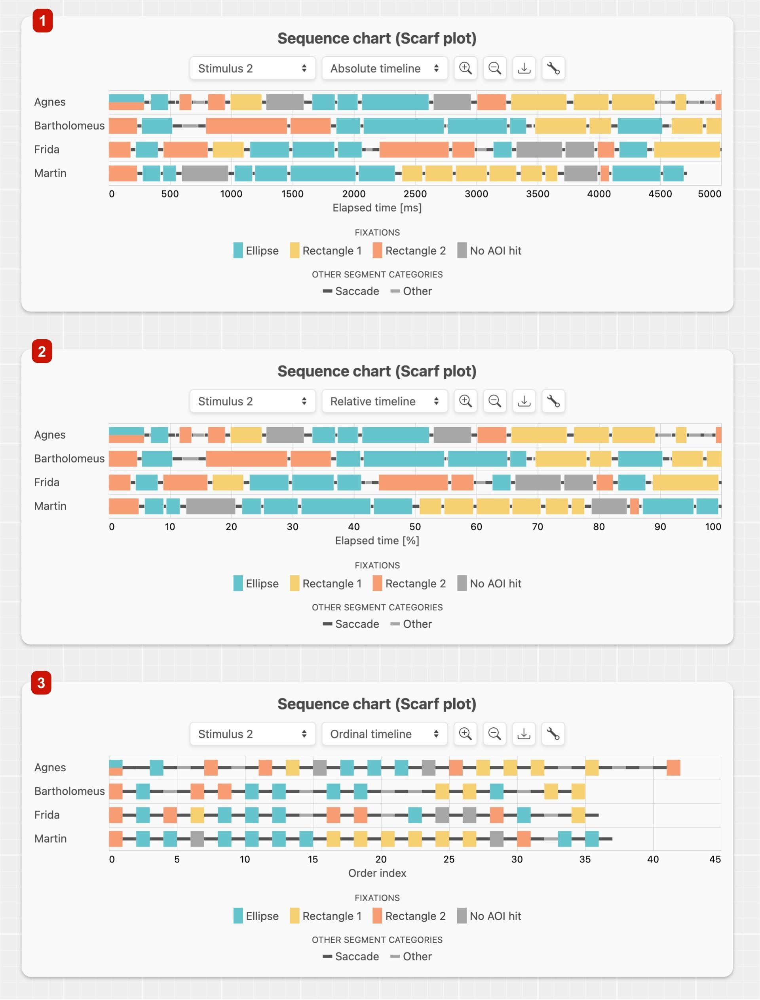

# Timeline representations
In GazePlotter's scar plots, you can switch between different timeline representations just by clicking on the timeline representation button (see [Main workplace overview](/basic/index.md#main-workplace-overview) for more information). 

The following timeline representations are available:
1. absolute time (in milliseconds)
2. relative time (to the duration of the dwell time of the participant with the highest dwell time)
3. ordinal time (just order indices of the individual fixations, saccades and other events like blinks)

::: danger
Some data, e.g. from [OGAMA software](/upload-data/ogama.md), support only ordinal time representation. In such cases, the timeline representation button is disabled.
:::