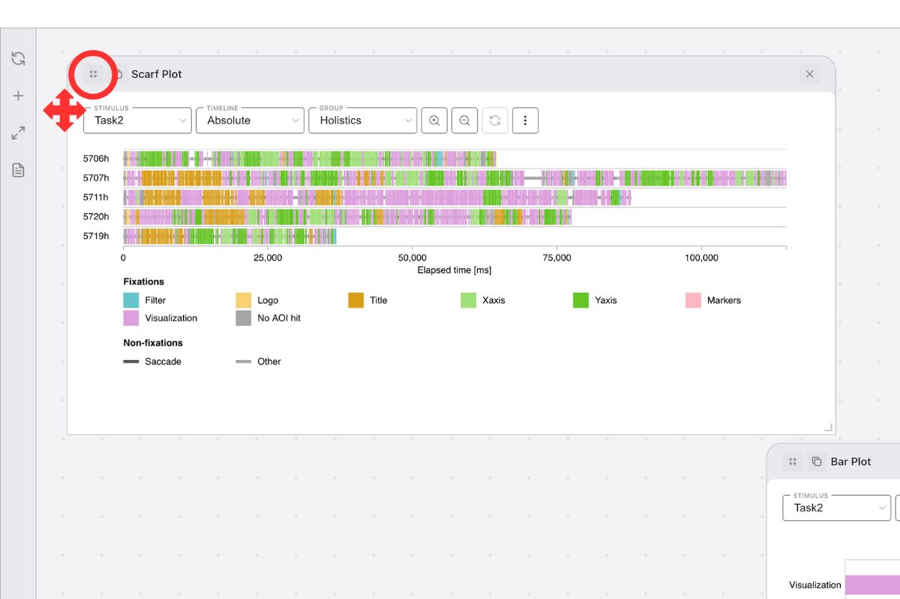
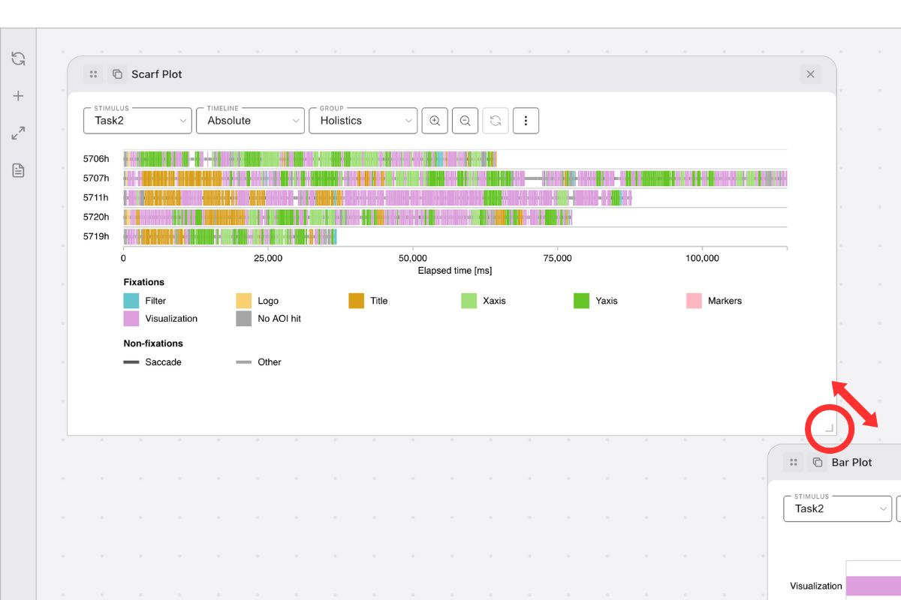
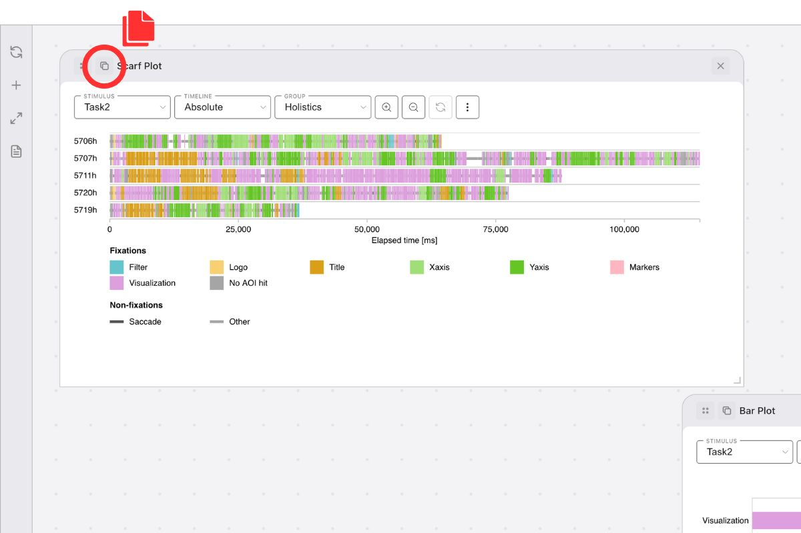
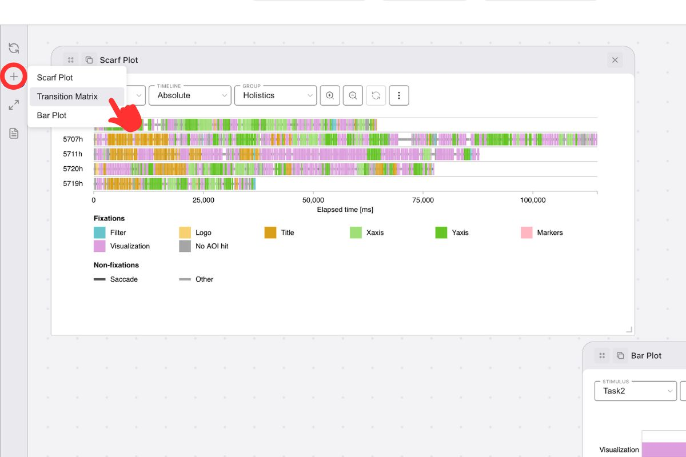
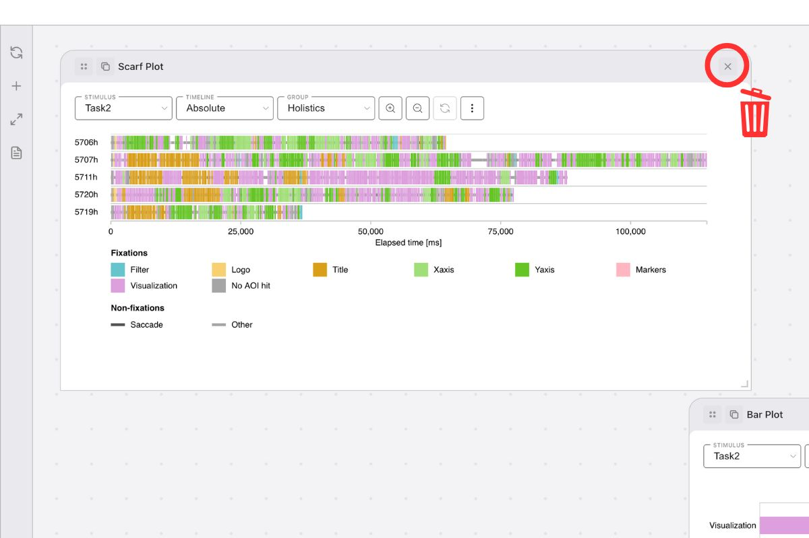

# Workspace

In GazePlotter, the workspace is the main area where you can view and interact with your eye-tracking data visualizations. The workspace enables you to create comprehensive dashboards with multiple plots, compare different participants or stimuli, and maintain complete control over your analysis layout.

## Workspace Toolbar

Vertical control panel on the left side providing quick workspace management:

- **Reset Layout** - Reorganize plots into clean grid layout
- **Add Visualization** - Create new [scarf plots](/basic/scarf-plot/), [bar plots](/basic/bar-plot/), or [transition matrices](/basic/transition-matrix/)
- **Toggle Fullscreen** - Distraction-free analysis mode
- **Source Metadata** - View detailed information about your data processing and system usage ([details](/advanced/source-metadata))

## Workspace Export & State Preservation

[Workspace export](/export/workspace/) creates comprehensive JSON files, which can be re-uploaded, preserving:

- **Complete Layout** - Exact plot positions and sizes
- **Plot Configurations** - All visualization settings and customizations
- **Participant Groupings** - Custom groups for comparative analysis
- **AOI Customizations** - Colors, names, and visual properties
- **Filter Settings** - Data filtering and selection criteria
- **Visualization Types** - All plot types with specific settings

::: tip Workspace Management
Use workspace export frequently to save your analysis configurations. The JSON files are small and perfect for:
- **Collaboration** - Share complete dashboards with team members
- **Backup** - Save analysis configurations before making changes
- **Templates** - Create reusable layouts for similar projects
- **Transfer** - Move workspaces between devices or systems
- **Version Control** - Track changes and maintain project history
:::

## Manipulating Plots in the Workspace

Drag-and-drop interface for plot management. More options in individual plots (see [Scarf plot](/basic/scarf-plot/)).

### How to move a plot around workspace? {#move-plot}
- Click and drag **drag handle** (4 dots icon) in plot header
- Plots snap to 50x50 pixel grid
- Workspace expands automatically at edges

{width="600" height="400"}

### How to resize a plot? {#resize-plot}
- Drag bottom-right corner to resize
- Maintains proportional sizing on 50x50 pixel grid

{width="600" height="400"}

### How to duplicate a plot? {#duplicate-plot}

Duplicating a plot creates an identical copy with all current settings preserved. This includes any applied participant groups, stimulus selections, axis adjustments, custom color palettes, AOI customizations, and all other visualization configurations. The duplicated plot appears in the same workspace and can be moved, resized, or further customized independently.

- Click the **Duplicate button** (copy icon) in the plot header at the top-left corner
- The duplicated plot will appear in the nearest empty place

{width="600" height="400"}

### How to add a new plot? {#add-plot}

- Click **Add Visualization** in the workspace toolbar (to the left of the workspace)
- Select one from available plot types
- The new plot will appear in the nearest empty place

{width="600" height="400"}

### How to remove a plot? {#remove-plot}

- Click the **Remove button** (X icon) in the plot header at the top-right corner
- The plot will be permanently removed from the workspace

{width="600" height="400"}