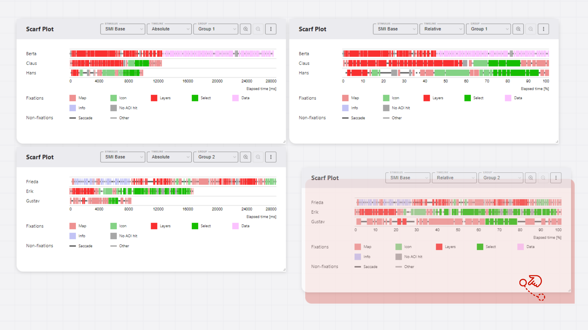
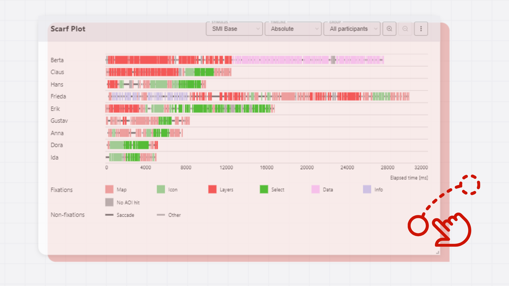
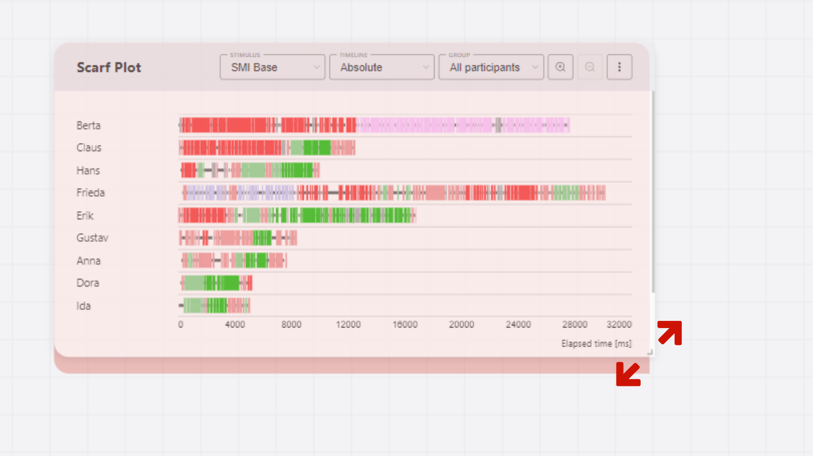

# Workspace
In GazePlotter, the workspace is the main area where you can view and interact with your eye-tracking data visualizations. In the workspace, you can view multiple scarf plots at the same time, therefore compare different participants or stimuli, and analyze the data in detail.

## Workspace controls
You control the content of the workspace using a drag-and-drop interface. You can move scarf plots around the workspace, resize them, and delete them. More options are attached to individual scarf plots (see [Scarf plot](/basic/scarf-plot/)).

### Moving plots
To move a scarf plot around the workspace, simply click on the plot outside of any buttons, controls or its main figure area, and drag it to the desired location. If the area is already occupied by another plot, the plot at the target location will be moved to the closest empty space.

::: info
Plots are moved in a grid-like manner, so they will snap to the closest empty space. The resolution of the grid is 50x50 pixels.
:::

::: info
If you move a plot to the edge of the workspace, the workspace will automatically expand to accommodate the new plot.
:::

### Resizing plots
To resize a scarf plot, click on the bottom right corner of the plot and drag it to the desired size. The plot will resize proportionally to the dragged corner.

::: info
The size of the plot changes in a grid-like manner, so it will snap to the closest grid point. The resolution of the grid is 50x50 pixels.
:::

### Adding and removing plots
Both adding and removing plots are done by:
1. Clicking on the `More options` button in the top right corner of the scarf plot.
2. Selecting `Duplicate scarf plot` for adding a new plot to the closest empty space in the workspace,
3. or `Delete scarf plot` for removing the plot from the workspace.

