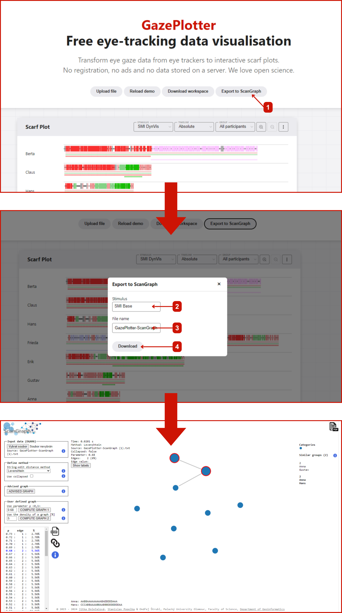

# ScanGraph Export

Export fixation sequences for scanpath analysis in the ScanGraph tool. Converts gaze data to letter-coded sequences for similarity comparison.

## Purpose

ScanGraph export enables:
- Scanpath similarity analysis
- Fixation sequence comparison between participants
- Advanced gaze pattern research
- Integration with ScanGraph analysis tool

## Export Process

1. Select **ScanGraph** in Export Format section
2. Choose desired stimulus to export
3. Set export file name
4. Click **Download** to save TXT file

## File Format

The exported `.txt` file contains:
- Fixation sequences as letter strings
- Each letter represents a fixation on an AOI
- Letter key provided in lines 4-5 of the file
- Compatible with ScanGraph software

## Using Exported Data

1. Upload the `.txt` file to [ScanGraph](http://eyetracking.upol.cz/scangraph)
2. ScanGraph will process fixation sequences
3. Compare scanpath similarities between participants
4. Generate similarity matrices and visualizations

## Future Development

Direct ScanGraph integration is planned for future GazePlotter versions. This will enable seamless scanpath analysis without external file transfers.

Contributors interested in this integration can contact [mail@vojtechovska.com](mailto:mail@vojtechovska.com). 